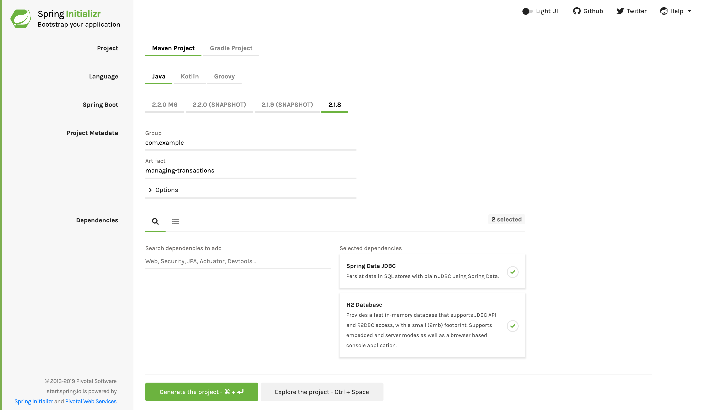

:spring_boot_version: 2.2.1.RELEASE
:SpringApplication: http://docs.spring.io/spring-boot/docs/{spring_boot_version}/api/org/springframework/boot/SpringApplication.html
:runner: http://docs.spring.io/spring-boot/docs/current/reference/htmlsingle/#boot-features-command-line-runner
:toc:
:icons: font
:source-highlighter: prettify
:project_id: gs-managing-transactions

This guide walks you through the process of wrapping database operations with
non-intrusive transactions.

== What You Will Build

You will build a simple JDBC application wherein you make database operations
transactional without having to write
http://docs.oracle.com/javase/tutorial/jdbc/basics/transactions.html#commit_transactions[specialized JDBC code].

== What You Need

:java_version: 1.8
include::https://raw.githubusercontent.com/spring-guides/getting-started-macros/master/prereq_editor_jdk_buildtools.adoc[]

include::https://raw.githubusercontent.com/spring-guides/getting-started-macros/master/how_to_complete_this_guide.adoc[]

[[scratch]]
== Starting with Spring Initializr

For all Spring applications, you should start with the https://start.spring.io[Spring
Initializr]. The Initializr offers a fast way to pull in all the dependencies you need for
an application and does a lot of the set up for you. This example needs the Spring Data
JDBC and H2 Database dependencies. The following image shows the Initializr set up for
this sample project:

NOTE: The preceding image shows the Initializr with Maven chosen as the build tool. You
can also use Gradle. It also shows values of `com.example` and `managing-transactions` as
the Group and Artifact, respectively. You will use those values throughout the rest of
this sample.

The following listing shows the `pom.xml` file that is created when you choose Maven:

====
[src,xml]
----
include::complete/pom.xml[]
----
====

The following listing shows the `build.gradle` file that is created when you choose Gradle:

====
[src,java]
----
include::complete/build.gradle[]
----
====

[[initial]]
== Create a Booking Service

First, you need to use the `BookingService` class to create a JDBC-based service that
books people into the system by name. The following listing (from
`src/main/java/com/example/managingtransactions/BookingService.java`) shows how to do so:

====
[source,java,tabsize=2]
----
include::complete/src/main/java/com/example/managingtransactions/BookingService.java[]
----
====

The code has an autowired `JdbcTemplate`, a handy template class that does all the
database interactions needed by the remaining code.

You also have a `book` method that can book multiple people. It loops through the list of
people and, for each person, inserts that person into the `BOOKINGS` table by using the
`JdbcTemplate`. This method is tagged with `@Transactional`, meaning that any failure
causes the entire operation to roll back to its previous state and to re-throw the
original exception. This means that none of the people are added to `BOOKINGS` if one
person fails to be added.

You also have a `findAllBookings` method to query the database. Each row fetched from the
database is converted into a `String`, and all the rows are assembled into a `List`.

== Build an Application

The Spring Initializr provides an application class. In this case, you need not modify
this application class. The following listing (from
`src/main/java/com/example/managingtransactions/ManagingTransactionsApplication.java`)
shows the application class

====
[source,java,tabsize=2]
----
include::complete/src/main/java/com/example/managingtransactions/ManagingTransactionsApplication.java[]
----
====

include::https://raw.githubusercontent.com/spring-guides/getting-started-macros/master/spring-boot-application-new-path.adoc[]

Your application actually has zero configuration. Spring Boot detects `spring-jdbc` and
`h2` on the classpath and automatically creates a `DataSource` and a `JdbcTemplate` for
you. Because this infrastructure is now available and you have no dedicated configuration,
a `DataSourceTransactionManager` is also created for you. This is the component that
intercepts the method annotated with `@Transactional` (for example, the `book` method on
`BookingService`). The `BookingService` is detected by classpath scanning.

Another Spring Boot feature demonstrated in this guide is
http://docs.spring.io/spring-boot/docs/current/reference/htmlsingle/#howto-initialize-a-database-using-spring-jdbc[the ability to initialize the schema on startup].
The following file (from `src/main/resources/schema.sql`) defines the database schema:

====
[source,sql]
----
include::complete/src/main/resources/schema.sql[]
----
====

There is also a {runner}[`CommandLineRunner`] that injects the `BookingService` and
showcases various transactional use cases. The following listing (from
`src/main/java/com/example/managingtransactions/AppRunner.java`) shows the command line
runner:

====
[source,java,tabsize=2]
----
include::complete/src/main/java/com/example/managingtransactions/AppRunner.java[]
----
====

include::https://raw.githubusercontent.com/spring-guides/getting-started-macros/master/build_an_executable_jar_with_both.adoc[]

You should see the following output:

====
[source,bash]
----
2019-09-19 14:05:25.111  INFO 51911 --- [           main] c.e.m.ManagingTransactionsApplication    : Starting ManagingTransactionsApplication on Jays-MBP with PID 51911 (/Users/j/projects/guides/gs-managing-transactions/complete/target/classes started by j in /Users/j/projects/guides/gs-managing-transactions/complete)
2019-09-19 14:05:25.114  INFO 51911 --- [           main] c.e.m.ManagingTransactionsApplication    : No active profile set, falling back to default profiles: default
2019-09-19 14:05:25.421  INFO 51911 --- [           main] .s.d.r.c.RepositoryConfigurationDelegate : Bootstrapping Spring Data repositories in DEFAULT mode.
2019-09-19 14:05:25.438  INFO 51911 --- [           main] .s.d.r.c.RepositoryConfigurationDelegate : Finished Spring Data repository scanning in 13ms. Found 0 repository interfaces.
2019-09-19 14:05:25.678  INFO 51911 --- [           main] com.zaxxer.hikari.HikariDataSource       : HikariPool-1 - Starting...
2019-09-19 14:05:25.833  INFO 51911 --- [           main] com.zaxxer.hikari.HikariDataSource       : HikariPool-1 - Start completed.
2019-09-19 14:05:26.158  INFO 51911 --- [           main] c.e.m.ManagingTransactionsApplication    : Started ManagingTransactionsApplication in 1.303 seconds (JVM running for 3.544)
2019-09-19 14:05:26.170  INFO 51911 --- [           main] c.e.managingtransactions.BookingService  : Booking Alice in a seat...
2019-09-19 14:05:26.181  INFO 51911 --- [           main] c.e.managingtransactions.BookingService  : Booking Bob in a seat...
2019-09-19 14:05:26.181  INFO 51911 --- [           main] c.e.managingtransactions.BookingService  : Booking Carol in a seat...
2019-09-19 14:05:26.195  INFO 51911 --- [           main] c.e.managingtransactions.AppRunner       : Alice, Bob and Carol have been booked
2019-09-19 14:05:26.196  INFO 51911 --- [           main] c.e.managingtransactions.BookingService  : Booking Chris in a seat...
2019-09-19 14:05:26.196  INFO 51911 --- [           main] c.e.managingtransactions.BookingService  : Booking Samuel in a seat...
2019-09-19 14:05:26.271  INFO 51911 --- [           main] c.e.managingtransactions.AppRunner       : v--- The following exception is expect because 'Samuel' is too big for the DB ---v
2019-09-19 14:05:26.271 ERROR 51911 --- [           main] c.e.managingtransactions.AppRunner       : PreparedStatementCallback; SQL [insert into BOOKINGS(FIRST_NAME) values (?)]; Value too long for column """FIRST_NAME"" VARCHAR(5) NOT NULL": "'Samuel' (6)"; SQL statement:
insert into BOOKINGS(FIRST_NAME) values (?) [22001-199]; nested exception is org.h2.jdbc.JdbcSQLDataException: Value too long for column """FIRST_NAME"" VARCHAR(5) NOT NULL": "'Samuel' (6)"; SQL statement:
insert into BOOKINGS(FIRST_NAME) values (?) [22001-199]
2019-09-19 14:05:26.271  INFO 51911 --- [           main] c.e.managingtransactions.AppRunner       : So far, Alice is booked.
2019-09-19 14:05:26.271  INFO 51911 --- [           main] c.e.managingtransactions.AppRunner       : So far, Bob is booked.
2019-09-19 14:05:26.271  INFO 51911 --- [           main] c.e.managingtransactions.AppRunner       : So far, Carol is booked.
2019-09-19 14:05:26.271  INFO 51911 --- [           main] c.e.managingtransactions.AppRunner       : You shouldn't see Chris or Samuel. Samuel violated DB constraints, and Chris was rolled back in the same TX
2019-09-19 14:05:26.272  INFO 51911 --- [           main] c.e.managingtransactions.BookingService  : Booking Buddy in a seat...
2019-09-19 14:05:26.272  INFO 51911 --- [           main] c.e.managingtransactions.BookingService  : Booking null in a seat...
2019-09-19 14:05:26.273  INFO 51911 --- [           main] c.e.managingtransactions.AppRunner       : v--- The following exception is expect because null is not valid for the DB ---v
2019-09-19 14:05:26.273 ERROR 51911 --- [           main] c.e.managingtransactions.AppRunner       : PreparedStatementCallback; SQL [insert into BOOKINGS(FIRST_NAME) values (?)]; NULL not allowed for column "FIRST_NAME"; SQL statement:
insert into BOOKINGS(FIRST_NAME) values (?) [23502-199]; nested exception is org.h2.jdbc.JdbcSQLIntegrityConstraintViolationException: NULL not allowed for column "FIRST_NAME"; SQL statement:
insert into BOOKINGS(FIRST_NAME) values (?) [23502-199]
2019-09-19 14:05:26.273  INFO 51911 --- [           main] c.e.managingtransactions.AppRunner       : So far, Alice is booked.
2019-09-19 14:05:26.273  INFO 51911 --- [           main] c.e.managingtransactions.AppRunner       : So far, Bob is booked.
2019-09-19 14:05:26.273  INFO 51911 --- [           main] c.e.managingtransactions.AppRunner       : So far, Carol is booked.
2019-09-19 14:05:26.273  INFO 51911 --- [           main] c.e.managingtransactions.AppRunner       : You shouldn't see Buddy or null. null violated DB constraints, and Buddy was rolled back in the same TX
----
====

The `BOOKINGS` table has two constraints on the `first_name` column:

- Names cannot be longer than five characters.
- Names cannot be null.

The first three names inserted are `Alice`, `Bob`, and `Carol`. The application asserts
that three people were added to that table. If that had not worked, the application would
have exited early.

Next, another booking is done for `Chris` and `Samuel`. Samuel's name is deliberately too
long, forcing an insert error. Transactional behavior stipulates that both `Chris` and
`Samuel` (that is, all the values in this transaction) should be rolled back. Thus, there
should still be only three people in that table, which the assertion demonstrates.

Finally, `Buddy` and `null` are booked. As the output shows, `null` causes a rollback as
well, leaving the same three people booked.

== Summary

Congratulations! You have just used Spring to develop a simple JDBC application wrapped
with non-intrusive transactions.

== See Also

The following guides may also be helpful:

* https://spring.io/guides/gs/spring-boot/[Building an Application with Spring Boot]
* https://spring.io/guides/gs/accessing-data-jpa/[Accessing Data with JPA]
* https://spring.io/guides/gs/accessing-data-mongodb/[Accessing Data with MongoDB]
* https://spring.io/guides/gs/accessing-data-mysql/[Accessing data with MySQL]

include::https://raw.githubusercontent.com/spring-guides/getting-started-macros/master/footer.adoc[]
